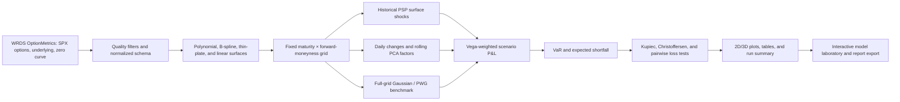

# Research roadmap

The canonical roadmap was recovered from the final thesis, `Thesis.ipynb`, `PSP_Edited.ipynb`, and `Cont_thesis.ipynb`. The notebook order and hard-coded intermediate files have been replaced by explicit pipeline stages.

## Stage definitions

1. Resolve historical SPX `secid` values from OptionMetrics security names.
2. Download annual option-price and underlying-price partitions only for the chosen interval; download the OptionMetrics zero curve for the same dates.
3. Normalize call/put labels and price units; calculate mid price, maturity, forward, forward moneyness, and normalized moneyness.
4. Apply the thesis quality rules: positive usable quotes, minimum price of $0.10, at least 15 days to expiry, configurable moneyness/spread bounds, and sufficient daily observations.
5. Fit a configurable daily log-IV surface. The production default is a tensor-product cubic B-spline; the paper's polynomial, thin-plate radial basis, and linear triangulation are available and compared on held-out quotes.
6. Evaluate every day on a stable maturity × forward-moneyness grid.
7. Apply PCA to daily grid changes, retain a configurable number of factors, and create 2D and 3D factor/reconstruction diagnostics.
8. Generate PSP scenarios by applying historical grid shocks with uniform or exponential recency weights. Re-estimate PCA only on the rolling information set and retain PWG as the full-grid Gaussian benchmark.
9. Map every method through the same documented vega exposure vector, then produce rolling VaR/ES, breach indicators, unconditional coverage, independence, and pairwise quantile-loss tests.
10. Save machine-readable data, validation tables, and figures with a run-level JSON summary. Long intervals use resumable raw and analysis partitions by year.
11. Expose the same configuration and result objects through a tabbed GUI so interactive studies remain exactly reproducible from YAML/JSON exports.

## Changes from the legacy workflow

- OptionsData inputs are replaced by WRDS OptionMetrics.
- FRED/Quandl keys and the PwG `markets yield curve` workbooks are not used.
- Dates, filters, grid, PCA, and risk settings are no longer hard-coded in notebooks.
- The computational path lives in tested Python modules; notebooks are archived as provenance only.
- Outputs are recreated from configuration instead of being treated as source data.

## Interactive application roadmap

The GUI is organized around linked research tasks: data and interval selection, volatility-surface
construction, factor analysis, stochastic scenarios, portfolio design, VaR/ES diagnostics,
robustness comparisons, and reproducible export. See [the GUI blueprint](gui_blueprint.md) for the
recommended screens, state model, and delivery phases.
